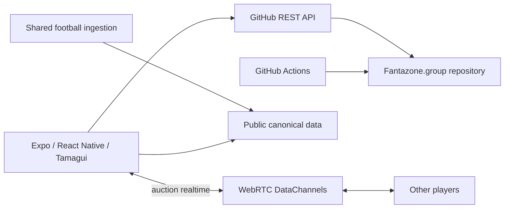

# Fantazone

> **Can a real fantasy-football application run without an application server?**  
> Fantazone is an open, educational experiment that is rebuilding [Fantasoccer](https://github.com/KeyserDSoze/Fantasoccer) around GitHub repositories, GitHub Actions and WebRTC.

[](https://github.com/KeyserDSoze/Fantazone/actions/workflows/ci.yml)
[](https://github.com/KeyserDSoze/Fantazone/actions/workflows/pages.yml)

**Public web demo:** https://keyserdsoze.github.io/Fantazone/

Fantazone is intentionally developed in public as a teaching repository. The interesting part is not only the fantasy-football product: it is the attempt to replace a traditional backend with primitives that developers already use every day.

## The experiment

The original Fantasoccer architecture uses an application backend, persistent repositories/storage, background workers and SignalR. Fantazone progressively replaces those responsibilities:



| Traditional responsibility | Fantazone primitive |
| --- | --- |
| Database / durable state | Versioned files in GitHub repositories |
| Object/static storage | Repository content / raw GitHub content |
| Background workers | GitHub Actions |
| Server-side deterministic calculations | Shared TypeScript domain code in app + Actions |
| SignalR auction hub | WebRTC DataChannels |
| Audit log | Git history + append-only domain events |
| Deployment | Static Expo web build + GitHub Pages |

## Current status

This is an active migration, not a finished production service.

Already working or scaffolded:

- Expo 57 / React Native / Tamagui application with web support;
- light and dark themes;
- PAT validation and discovery of repositories named `Fantazone.*`;
- creation and initialization of a group repository;
- native credential persistence through Expo SecureStore;
- invite payload import from a URL fragment;
- framework-independent TypeScript domain package;
- first Fantasoccer parity rules and tests (season, league administration, market rules);
- GitHub Actions job runner foundation;
- CI that typechecks, tests and exports the real static web application;
- documented WebRTC auction protocol and migration plan.

The living backlog is [`docs/06-migration-checklist.md`](docs/06-migration-checklist.md).

## Try it without credentials

The public web application contains an **architecture tour** that requires no GitHub credential. It exists specifically so the repository can be shown at meetups, conferences and workshops without distributing a token.

Connecting or creating a real fantasy-football group still uses the V1 PAT flow described below.

## Important security note about the V1 PAT design

The current shared-PAT onboarding is deliberately a **prototype/teaching mechanism**, not the final production security model.

An invite fragment is encoded, **not encrypted**. Anyone who obtains an invite containing a PAT can use that credential with the permissions granted to it. Never use a broad personal token for a demo group. Prefer a dedicated fine-grained token with the smallest possible repository scope and rotate it if it leaks.

The GitHub access layer is kept behind an adapter so the PAT can later be replaced by a GitHub App/OAuth flow without rewriting product features. Read [`SECURITY.md`](SECURITY.md) and [`docs/10-public-security-model.md`](docs/10-public-security-model.md) before using the write path with real data.

## Repository layout

```text
.github/workflows/   CI, Pages, ingestion and recalculation workflows
docs/                Product, architecture and migration documentation
src/app/             Expo / React Native / Tamagui application
src/domain/          Framework-independent TypeScript business rules/contracts
src/github/          GitHub repository client and persistence adapters
src/jobs/            Background-job runners used by GitHub Actions
tests/               Domain, GitHub adapter, application and job tests
```

## Read the project as a lesson

A useful order is:

1. [`docs/01-feature-inventory.md`](docs/01-feature-inventory.md) — what the old application actually does;
2. [`docs/02-zero-server-architecture.md`](docs/02-zero-server-architecture.md) — the target architecture;
3. [`docs/07-runtime-topology.md`](docs/07-runtime-topology.md) — why global ingestion and per-group computation are separated;
4. [`docs/08-legacy-service-matrix.md`](docs/08-legacy-service-matrix.md) — how every old transport is being replaced;
5. [`docs/05-webrtc-auction.md`](docs/05-webrtc-auction.md) — the realtime experiment;
6. [`docs/09-event-demo.md`](docs/09-event-demo.md) — a short live-demo path for talks and workshops.

## Local development

```bash
npm install
npm run typecheck
npm test
npm run app:web
```

A production-like static export is checked in CI:

```bash
npm run export:web --workspace=fantazone-app
```

## Contributing

The migration rule is simple: **preserve behavior first, replace infrastructure second**. When possible we extract deterministic Fantasoccer behavior into `@fantazone/domain`, port or create parity tests, and only then replace HTTP/storage/realtime integrations.

See [`CONTRIBUTING.md`](CONTRIBUTING.md).
